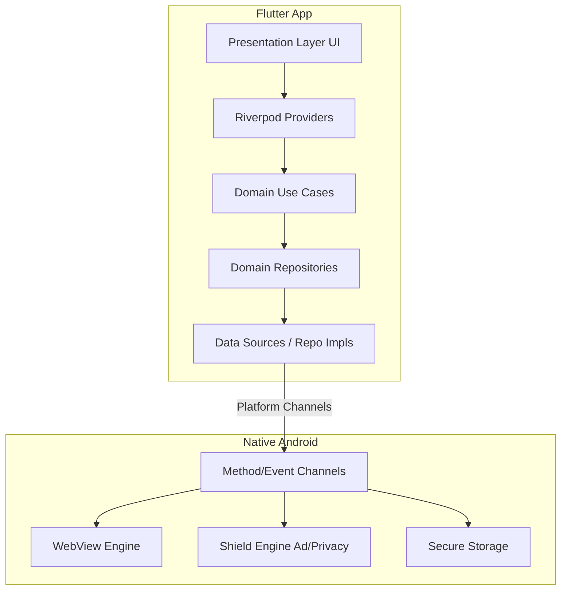

# WebNest Project Tracking

## Architecture Diagram (Flutter + Native Hybrid)

## Milestone Tracker
- `[x]` **Milestone 1**: Project Initialization & Core Architecture Setup
- `[x]` **Milestone 2**: Platform Channel Foundation & Basic Native WebView (Mobile)
- `[x]` **Milestone 3**: Profile Management & State Persistence
- `[x]` **Milestone 4**: WebNest Shield (Ad & Privacy Engine) v1
- `[x]` **Milestone 5**: Advanced Features (Downloads, PiP, Audio Focus)
- `[x]` **Milestone 6**: UI Polish, Tablets, Animations, Accessibility

## Feature Checklist
- `[ ]` Website Library
- `[ ]` Website Profiles
- `[ ]` Custom Icons & Theme Color Detection
- `[ ]` Storage/Cookies/Permissions Isolation
- `[ ]` Web Engine (JS, DOM Storage, Media Capture)
- `[ ]` WebNest Shield Engine
- `[ ]` Desktop/Mobile Mode toggle
- `[ ]` Background Audio & PiP
- `[ ]` Dark Mode

## Known Risks & Technical Debt
- **Risk**: PlatformView performance for high-framerate scrolling needs careful Hybrid Composition validation.
- **Risk**: Advanced background media playback in WebViews might be blocked by site-specific DRM or policies.
- **Debt**: None yet (Phase 1).

## Pending Decisions
- Finalize Kotlin native WebView vs `flutter_inappwebview` package (Implementation Plan recommends custom native for maximum control).
